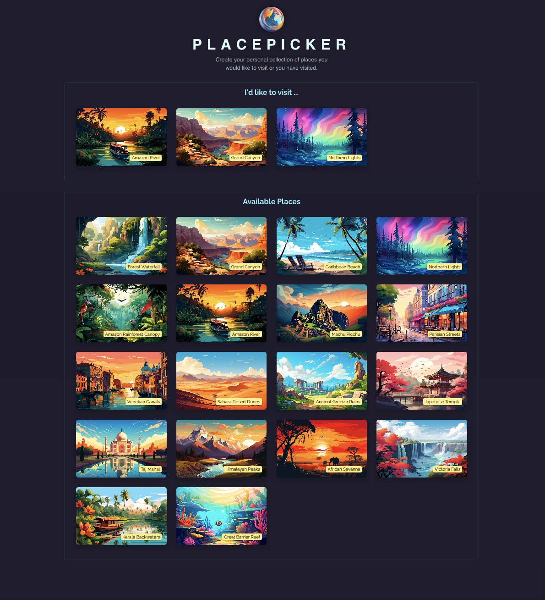

# React Effects Basic - Place Picker

A React app that allows users to create a personal collection of places they'd like to visit or have already visited. The app uses the Geolocation API to sort available places by proximity and allows users to manage their selected places with features such as adding and removing them from their collection.
<br><br>


## 🚀 Getting Started

### **Prerequisites**
Make sure you have the following installed before running the project:
- **Node.js** (Download from [nodejs.org](https://nodejs.org/))
- **npm** or **yarn** (Comes with Node.js)
<br>

### **Installation**
1. Clone this repository:
   ```sh
   git clone https://github.com/nathenpriyonggo/react-effects-basic
   ```
2. Navigate to the directory
   ```sh
   cd react-effects-basic
   ```
3. Install dependencies:
   ```sh
   npm install
   ```
4. Start the development server:
   ```sh
   npm run dev
   ```
5. Open ```http://localhost:5173/``` in your browser.
<br>

## 🛠️ Built With
- **React** - A JavaScript library for building user interfaces
- **Vite** - A fast build tool for modern web projects
- **Geolocation API** - For fetching the user's current location
- **React Portal** – Used for rendering modal dialogs
- **Styled Components** – For CSS-in-JS styling
<br>

## 🎯 App Features
- **Geolocation-based Place Sorting** – Automatically sorts available places based on the user's current location.
- **Add Places to Collection** – Allows users to select places from the available list and add them to their collection.
- **Remove Places from Collection** – Prompts a confirmation dialog before removing a place from the collection.
- **Responsive Modal Dialogs** – Uses React Portals to handle modal rendering efficiently.
- **Progress Bar Timer** – A visual timer countdown before confirming actions, such as deleting a place.
<br>

## 🖥️ Preview
<p align="center"></p>
<br>

## 📜 License
This project is open-source. Feel free to fork, modify, and expand upon it!
<br><br>


---

✨ Happy coding! 🚀
